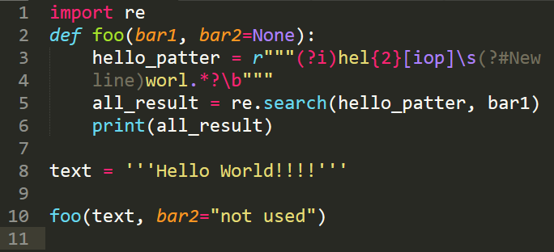
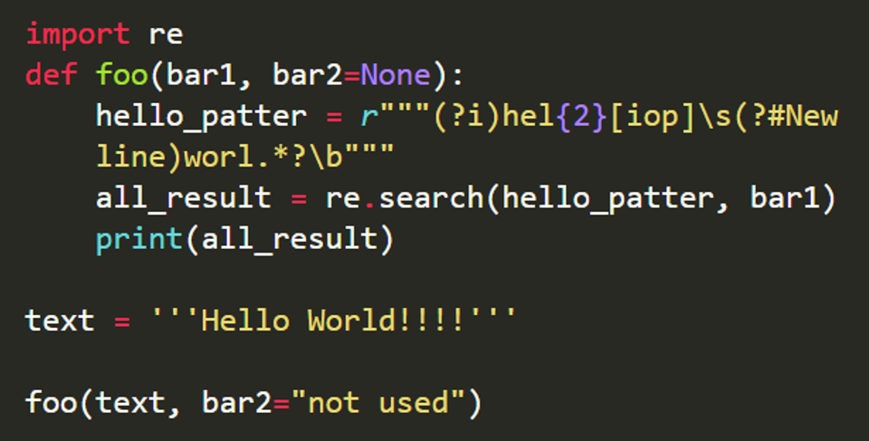
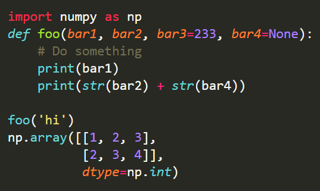

# enhanced_Pygments_lexers

Since I am not really happy with [Pygments](https://pygments.org/)' lexical analysis result, and I really could not find another tool that is as easy to use as Pygments, I start this repo for improved code lexing plugins for Pygment users (myself). The improvement is mainly about adding more syntax scopes. For example, arguments in a Python function/method call.  

## Stages of Goals

1. Make this plugin be able to parse as many types of Python elements as Sublime Text editor can.  
2. Wrap it as a extension to Python Markdown module.  
3. Extend to other programming languages that I frequently use (and whose Pygments output I'm not satisfied with)  

## Current Achievements

### Python3

- Function, object method, builtins being called
- Argument names in function definition
- keyword argument name in callable calling
- Regex raw string

Demonstration code:  

```python
import re
def foo(bar1, bar2=None):
    hello_patter = r"""(?i)hel{2}[iop]\s(?#New
    line)worl.*?\b"""
    all_result = re.search(hello_patter, bar1)
    print(all_result)

text = '''Hello World!!!!'''

foo(text, bar2="not used")
```

How it looks in Sublime Text editor under **Monokai** theme:  

  

How it looks in browser after conversion by the native Pygments conversion, using a CSS defined as close to Monokai as possible [`examples/highlight.css`](examples/highlight.css):  

  

How it looks in browser after conversion by the enhanced lexer, using the same CSS:  

  
